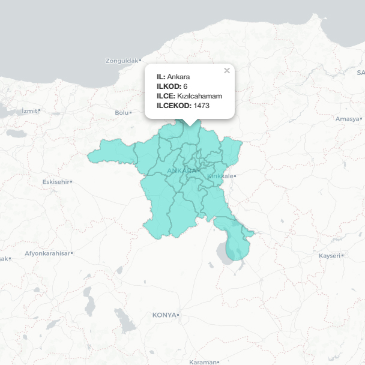

# Ankara district polygons

I needed the district polygons of Ankara, Turkey, for my thesis back in 2020. The ones I could find were heavily out-of-date since some significant boundary changes were made in the past couple of years, so I decided to create my own. I am sharing this as is in case someone needs it. For the moment (January 18, 2021), it still looks up-to-date. I do not plan to update it myself unless I need the up-to-date version in the future, but I will mention some details about the process. If you know how to use QGIS (or similar software), it should be easy enough for you. If you are interested in more than Ankara, there are some problems you need to know.

## Method and data

The administrative boundaries of the whole country are found [here](https://www.harita.gov.tr/urun-267-haritasi.html&katid=14), on the website of [the General Directorate of Mapping](https://en.wikipedia.org/wiki/General_Directorate_of_Mapping). It looks like they permit redistribution, so a zipped copy of the source files are provided in the repository, but I would advise dowloading [the RAR file](https://www.harita.gov.tr/images/urunler/Turkiye_mulki_idare_sinirlari.rar) served by them in case they update it.

Unfortunately, the files ("İlce") simply include the polylines and not the polygons, so they are polygonized in QGIS (using the "Polygonize" tool). The official district codes and such are added manually for each polygon:

* IL: City name
* ILKOD: Official city code (not zero-padded)
* ILCE: District name
* ILCEKOD: Official district code

## Preview

You can use it with other maps. Here is a preview I created using Leaflet in R:

## Obtaining the district polygons of the whole country

You can do this, but there are some problems, which is why I did not share them. I am not a GIS expert, and I did not try very hard, but you might succeed. You can also watch a corresponding tutorial (in Turkish) [here](https://www.youtube.com/watch?v=lDEzb9JOHu4). However, while the same issues are seen in that video, it does not explain (or acknowledge) them.

### Country boundaries

There are a lot of very close Greek islands that are somehow included in the files. You need to clean them by overlapping the boundaries with some other maps. I could solve this by using an older shapefile, but this also causes the coastline to revert to its older shape. Alternatively, you could also use the points from the "yerlesim_nokta" files, but it causes some data loss. It requires some manual work or slightly more sophisticated operations.

### District boundaries

When you polygonize the lines, you will see that parts of the Sea of Marmara are filled in. You can easily select those polygons and delete them or delete the corresponding lines before polygonization. More importantly, a district in the top left corner of the country disappears. I tried to solve it by overlaying the other maps provided in the same RAR file, but it did not work. The city and region files have this problem as well. I tried to manually combine the lines to obtain a closed shape, but it did not work either. It looks like the original files are the culprit here. This one requires some manual work as well.

### District names and codes

You can use the points in "yerlesim_nokta" files instead of manually labeling each polygon like I did, especially if you are working with a larger area. Just join those points with the district polygons by location. Unfortunately, some districts have multiple disjoint polygons (such as islands), and only one of them is pinpointed in the "yerlesim_nokta" files. You will need to find those (manually or possibly by subtracting them from the labeled and incomplete ones) and manually label them (or take some countermeasures to compensate for the lack of points).

Also, these files do not include the official city and district codes. If you plan to use them for visualizing some tabular data, you would prefer to have them. You could also use the city and district names, but some details should be handled even with the official data. Some names change in time ("Kazan" → "Kahramankazan"), some names can be abbreviated ("Kahramanmaraş" → "K.maraş"), and some Turkish characters can be anglicized ("Şanlıurfa" → "Sanliurfa"). Alternatively, if you have some older maps that have these official codes, I suppose you could use the percentage of overlap to match the district codes of the out-of-date polygons with the up-to-date polygons, but it would still require some manual corrections for at least some of the districts.

Good luck.